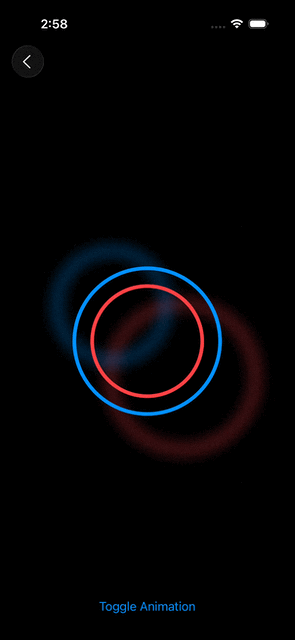

# Scribbles-iOS — SwiftUI Animations Guide

This repository contains small SwiftUI experiments and examples exploring animation techniques on iOS. The goal of this guide is to provide a compact, practical reference for learning and testing SwiftUI animations using the example views in the `Scribbles` app.

## Quickstart
1. Open `Scribbles.xcodeproj` in Xcode (or open the workspace in Xcode 12+).
2. Select a simulator or device and run the `Scribbles` target.

If you just want to preview or inspect the SwiftUI views without running the entire app, open `Scribbles/Scribbles/Views/` in Xcode and use the SwiftUI canvas Previews.

## Samples
### 1. Chandeliers
#### [File Link](Scribbles/Scribbles/Views/Chandeliers.swift)

## Core concepts & examples
Below are concise explanations and code snippets (adapted from the views in this repo) to illustrate common SwiftUI animation patterns.

### 1) Implicit animations

Description: SwiftUI can animate changes to view state automatically using modifiers like `.animation()` or `.withAnimation {}`. Use implicit animations for simple, state-driven UI transitions.

Example pattern:

- Toggle a @State property that affects view layout or appearance.
- Attach `.animation(...)` to the view or use `withAnimation` when changing state.

Common use cases:
- Fading, scaling, color changes, offset and padding adjustments.

### 2. Explicit animations

Description: For more control, use `withAnimation(_:_:)` or `Animation` values like `.easeInOut`, `.spring()`, or `.interactiveSpring()`.

Example:

- Use `Animation.spring(response: , dampingFraction: , blendDuration: )` for physics-like motion.
- Coordinate multiple state changes by wrapping them inside a single `withAnimation` block.

## Credits
- Created by the repository owner as a personal collection of SwiftUI experiments inspired from various sources.
- Feel free to use the code.

### License
- See the repository `LICENSE` file for licensing details.

